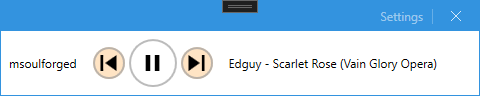

# Mini Spotify Controller

I am not a big fan of the original Spotify App that does not have a mini player. I just want a tiny window that displays current track, and play/pause, next, previous track feeatures. So I have written this small applicatin which uses Spotify Web API to control the streaming. Note that this application does not stream; it just works as a mini controller to the actual device that is streaming the track. It gets the active device from the API, so you can control any source (phone, PC...etc.). It only displays the current track name, artist name and album name to be minimal; but you can always open your streaming app for more information.

When you run the application, it will open a small window that you need to enter the client id for the Spotify API . You can get the client id from https://developer.spotify.com/dashboard/applications. You need to create an application and get the client id. Then you need to enter the client id to the application. After that, it will open a browser window to authenticate and authorize the application. After you authorize the application, it will close the browser window and start working.

The application requires to have a Spotify Premium account to work. It will not work with free accounts, since free accounts does not support Web API.

## Features
* Mini controller to start, pause, next, previous tracks.
* Displays current track, artist and album name.
* Requires a spotify device to be active. If there is no active device, it show a message to open a Spotify app in any of your devices.

## How to build
* Clone the repository.
* Open the solution in Visual Studio (preferably 2023).
* Build the solution.

## Requirements
* Windows 10.0.17763.0 or newer. This is because the application uses `Microsoft.Toolkit.Uwp.Notifications` library which requires Windows 10.0.17763.0 or newer.
* .NET 7
* Spotify Premium account

## 3rd Party Dependencies

* .NET 7
* Mahapps.Metro (UI): A great UI library for WPF applications. https://mahapps.com/
* Mahaps.Metro.IconPacks: A great icon library for WPF applications.
* CommunityToolkit.MVVM: A great MVVM library for WPF applications.
* Microsoft.Extensions.DependencyInjection: A great DI library for .NET applications.
* Microsoft.Toolkit.Uwp.Notifications: A great library for Windows toast notifications.
* Microsoft.Web.WebView2: A great library for Chromium based webview. It is used to display the user authentication and authorization page.
* Microsoft.Xaml.Behaviors.Wpf: A great library for WPF behaviors (mainly used for binding commands to event handlers).

## TODO
* ~~Implement displaying like (i.e. added to library) status~~
* ~~Implement liking (i.e. adding to library) and unliking (i.e. removing from library) tracks.~~
* ~~Add an icon to the application.~~
* ~~Add a feature to display the track progress and (maybe) allow to seek.~~
* ~~Currently the application makes an API call at every 10 seconds to get the current playback state. It can be changed so that it only makes an API call when the playing track has ended (based on the track progress and the track duration). This will still fail to capture changes made from other devices, but it will be more efficient.~~ Now the application keeps track of the track progress offline. It only makes an API call when the track has ended. This fails to capture changes made from other devices, but it is more efficient.
* ~~If spotify allows web sockets, it can be used to get the current playback state in real time. This will allow to capture changes made from other devices.~~ It looks like Spotify does not support web sockets.
* ~~Seeking method is available but not implemented yet.~~ Seeking is implemented by `PreviewMouseUp` and `PreviewMouseDown` events manipulating an `IsSeeking` flag. This allows to stop the auto-movement of the slider during seeking, and also allows to seek to the desired position when the mouse button is released.