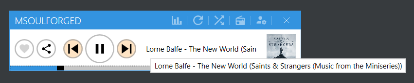

# Mini Spotify Controller

I am not a big fan of the original Spotify App that does not have a mini player. I just want a tiny window that displays current track, and play/pause, next, previous track feeatures. So I have written this small applicatin which uses Spotify Web API to control the streaming. Note that this application does not stream; it just works as a mini controller to the actual device that is streaming the track. It gets the active device from the API, so you can control any source (phone, PC...etc.). It only displays the current track name, artist name and album name to be minimal; but you can always open your streaming app for more information.

When you run the application, it will open a small window that you need to enter the client id for the Spotify API . You can get the client id from https://developer.spotify.com/dashboard/applications. You need to create an application and get the client id. Then you need to enter the client id to the application. After that, it will open a browser window to authenticate and authorize the application. After you authorize the application, it will close the browser window and start working.

The application requires to have a Spotify Premium account to work. It will not work with free accounts, since free accounts does not support Web API.

## Features
* Mini controller to start, pause, next, previous tracks.
* Displays current track, artist and album name.
* A randomizer! See below for details.
* Requires a spotify device to be active. If there is no active device, it show a message to open a Spotify app in any of your devices.

### Randomizer

The randomization flow is as follows:
1. User clicks the randomize button.
2. Set the randomization limit k to 10000.
3. Get the user's 50 (API upper limit) saved tracks from the API with a random offset between 0 and k.
4. If the saved tracks return empty, the offset is greater than the number of user's saved tracks. In this case, halve the k and go to step 3. Otherwise, go to step 6. 
5. If k reaches zero and the saved tracks return empty, then there is no saved track. In this case, show a message to the user and stop.
6. If there are more than 5 tracks (API max seed track count) in the saved tracks, pick 5 random tracks from the saved tracks. Otherwise, pick all of the saved tracks.
7. Send a recommendation request to the API for 100 tracks (API upper limit) with the picked tracks as seed tracks.
8. If the recommendation request returns empty, notify the user that there is no recommendation and stop. Otherwise, go to step 9.
9. Send a request to the API to play all the tracks in the recommendation response.
10. Start groovin'!.

## How to build
* Clone the repository.
* Open the solution in Visual Studio (preferably 2023).
* Build the solution.

## Requirements
* Windows 10.0.17763.0 or newer. This is because the application uses `Microsoft.Toolkit.Uwp.Notifications` library which requires Windows 10.0.17763.0 or newer.
* .NET 7
* Spotify Premium account

## 3rd Party Dependencies

* .NET 7
* Mahapps.Metro (UI): A great UI library for WPF applications. https://mahapps.com/
* Mahaps.Metro.IconPacks: A great icon library for WPF applications.
* CommunityToolkit.MVVM: A great MVVM library for WPF applications.
* Microsoft.Extensions.DependencyInjection: A great DI library for .NET applications.
* Microsoft.Toolkit.Uwp.Notifications: A great library for Windows toast notifications.
* Microsoft.Web.WebView2: A great library for Chromium based webview. It is used to display the user authentication and authorization page.
* Microsoft.Xaml.Behaviors.Wpf: A great library for WPF behaviors (mainly used for binding commands to event handlers).

## New Features

### 1.1.3

* Added randomizer feature. See above for details.
* Fixed a bug where the image cover art was updated every second (which was not necessary).

### 1.1.2

* Added a "Stats for Nerds" style "audio features" window. It can be accessed by the button on the app bar with a chart icon.

### 1.1.1

* Added a feature to share. Clicking the share button will copy the currently playing track's Spotify url to the clipboard.

### 1.0.0

* Added a feature to display if the current track is added to the library or not. User can click the heart icon to add or remove the track from the library. Added tracks will be displayed with a red heart icon, and removed tracks will be displayed with a light gray heart icon.

## TODO
* Fix the issue where the client id is not registered on the first launch of the application.
